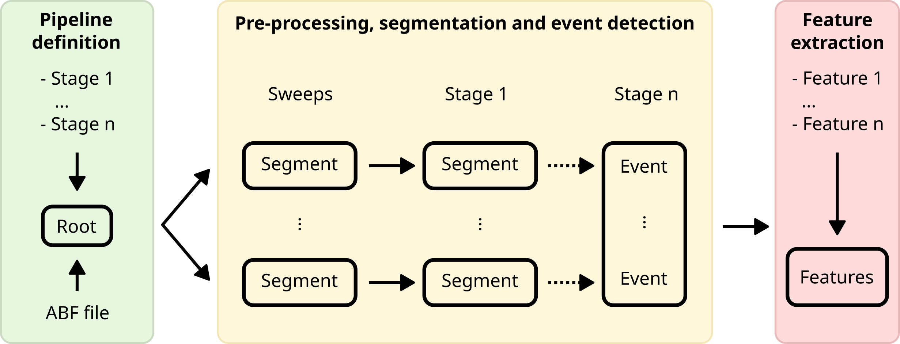
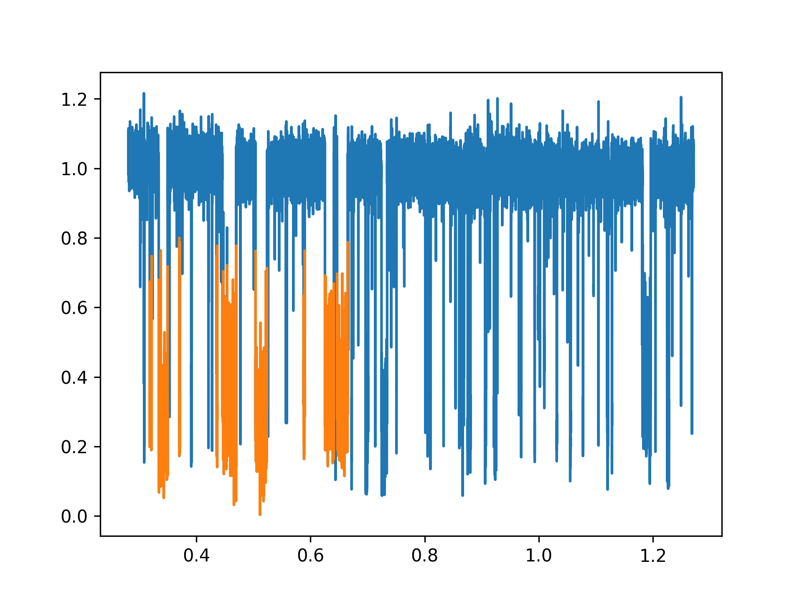
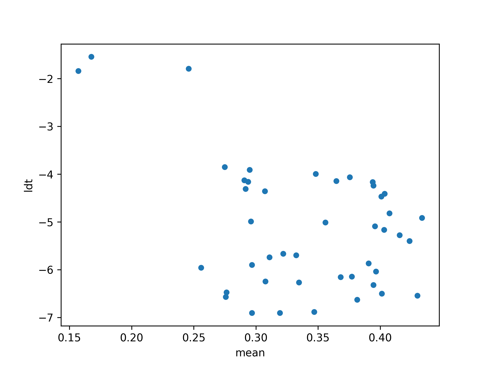

# NanoTRACE — Nanopore Toolkit for Reproducible Analysis of Conductive Events
`nanotrace` is a python library for automated nanopore electrophysiology (1d timeseries) manipulation and feature extraction.

## Graphical abstract (very rough, work in progress)


## Table of contents
This guide covers the following topics:

1. [Installation](#installation)
2. [Updating](#updating)
3. [Usage example](#usage)
4. [Available stages](#available-stages)
    * [Custom stages](#defining-a-custom-stage)
2. [Inspection and validation](#inspection-and-validation)
    * [Example](#example)
5. [Feature extraction](#feature-extraction)
    * [Example](#example-1)

## Installation
1. Ask **Matthijs** for an invite to the private github repository (it's private for now as I want to refine it a bit before I publish it).

###  <span style="vertical-align: middle;">Windows</span>
2. [Install GIT](https://git-scm.com/downloads/win)
3. [Install Anaconda or miniconda](https://www.anaconda.com/docs/getting-started/anaconda/install#windows-installation)
4. Create a virtual environment that you want to use for 
5. Open the Anaconda cmd prompt **from the correct environment**

###  <span style="vertical-align: middle;">Linux</span>
2. Install git from whatever software repository you use (i.e. `sudo apt install git` for ubuntu/debian)
3. (optional) install conda if you prefer
4. Create a virtual environment where you want to use the pipeline: `$ pip -m venv venv`
5. Activate the virtual environment: `$ . venv/bin/activate`

### All platforms
7. Install the module from the private repo: `pip install git+https://github.com/mjtadema/porepipe.git@master`

## Updating
Update using the latest development version: `pip install --upgrade --force-reinstall --no-deps git+https://github.com/mjtadema/porepipe.git`

Update using the latest stable version **(Recommended)**: `pip install --upgrade --force-reinstall --no-deps git+https://github.com/mjtadema/porepipe.git@master`

## Usage
The pipeline is defined and used through the [Pipeline object](#pipeline-design). As a convention, class names use what is known as "CamelCase", while other variables use_this_style_of_naming. Available pipeline stages can be found [here](#available-stages).

### Pipeline definition

```python
# Example:
from nanotrace import *
# This imports Pipeline, ABF, stages and feature extractors

# run `help(nanotrace.stages)` to list built-in stages
# run `help(nanotrace.features)` to list built-in feature extractors

# Defining the ABF object separately is handy because 
# we often need access to the sample rate
abf = ABF("some_abf_file.abf")
fs = abf.sampleRate # get sample rate in Hz

# Define the pipeline with some stages
pipeline = Pipeline(
    stage_1(),
    stage_2(),
    stage_3()
)
```

The pipeline takes any number of functions (or `callables`) as arguments that make up the stages of the pipeline in the order that they will be run.
You can also import the `Pipeline` class from the root of the module with `from Pipeline import pipeline`.
You can also import the pipeline stages using `from porepipe.stages import *`
Available stages can be listed by running `help(pipeline.stages)` or `?pipeline.stages` in iPython or Jupyter notebook.

## Available stages
### Single output segment

| Syntax                             | Description                                                                                                                                                                                                                                          |
|------------------------------------|------------------------------------------------------------------------------------------------------------------------------------------------------------------------------------------------------------------------------------------------------|
| `lowpass(cutoff_fq, fs, order=10)` | Apply a lowpass filter with `cutoff_fq` as the cutoff frequency in Hz, `fs` as the sampling rate and `order` as the order of the filter. The sampling rate can be extracted from an abf file using `ABF().SampleRate`                                |
| `as_ires(minsamples=1000)`         | Calculate the _residual current_ (Ires) from the baseline. Automatically detects the baseline based on a binning approach. `minsamples` determines how many samples a bin needs to be considered a proper level and not just a fast current "spike". |
| `trim(left=0, right=1)`            | Trim off this many samples from the `left` or the `right` side.  If the sampling rate was assigned to a variable named `fs`, you can use this to calculate how many _seconds_ to trim off each side using `nseconds * fs`.                           |

### Multiple output segments

| Syntax                                            | Description                                                                                                                                                                                                                                                                                                                                                                                                           |
|---------------------------------------------------|-----------------------------------------------------------------------------------------------------------------------------------------------------------------------------------------------------------------------------------------------------------------------------------------------------------------------------------------------------------------------------------------------------------------------|
| `switch()`                                        | Segment a gapfree trace based on large, short, current spikes cause by manual voltage switching.                                                                                                                                                                                                                                                                                                                      |
| `threshold(lo,hi)`                                | Segment an input segment by consecutive stretches of current between `lo` and `hi`.                                                                                                                                                                                                                                                                                                                                   |
| `levels(n, tol=0, sortby='mean')`                 | Detect sublevels by fitting a [gaussian mixture model](https://scikit-learn.org/stable/modules/generated/sklearn.mixture.GaussianMixture.html). Use `n` to set the number of gaussians to fit, `tol` is a number between 0 and 1 and controls how much short spikes are tolerated. `sortby` controls how the gaussians are labeled, can be sorted by "mean" or by "weight" (weight being the height of the gaussian). |
| `volt(c, v)` | Select part of a sweep where the control voltage `c` matches the target voltage `v` |

### Decorators
[Decorators](https://peps.python.org/pep-0318/) are functions that wrap around other functions with a convenient syntax. I use them to _enhance_ the "default" behavior of the stages and they live in `porepipe.decorators`. The following decorators are predefined:

| Name                                | Description                                                                                                                                                                                                                                                                                                                   |
|------------------------------------|-------------------------------------------------------------------------------------------------------------------------------------------------------------------------------------------------------------------------------------------------------------------------------------------------------------------------------|
| `cutoff`                           | Add a filter to a stage that blocks yielding segments _smaller than_ the cutoff. `cutoff` adds the "cutoff" keyword argument to a stage.                                                                                                                                                                                      |
| `partial`                          | Essentially functions as [functools.partial](https://docs.python.org/3/library/functools.html) but in a decorator form for convenience. Allows pre-defining some arguments when the decorated function is called. I use it to set keyword arguments and only leave _positional arguments_ to be filled when the stage is run. |


### Defining a custom stage
Stages are functions (`callable`s) that take only two _positional arguments_: `t`(time) and `y`(current). The function then does something to transform the data or calculate new segments and `yield`s segments. By using `yield` instead of `return` the function is turned into a [generator](https://docs.python.org/3/reference/expressions.html#yieldexpr) and can be used as an `iterable`. All stages need to be `generator`s or return an `iterable`.

```python
def new_stage(t,y):
    """An example pipeline stage that "yields" new segments"""
    t_segments = f(t)
    y_segments = f(y)
    for new_t, new_y in zip(t_segments, y_segments):
        # Using "yield" turns the function into a generator
        yield new_t, new_y
```

The stage can then be given to the pipeline like so:

```python
Pipeline(
    new_stage
)
```

Extra options can be given when the pipeline is defined by using the `partial` decorator when defining the function like so:

```python
from nanotrace.decorators import partial

@partial
def new_stage(t,y,*,extra_argument):
    """An example pipeline stage that "yields" new segments"""
    t_segments = f(t, extra_argument)
    y_segments = f(y, extra_argument)
    for new_t, new_y in zip(t_segments, y_segments):
        # Using "yield" turns the function into a generator
        yield new_t, new_y

Pipeline(
    new_stage(extra_argument)
)
```

The `cutoff` decorator is used on a many built-in stages to filter out segments that are too short. It can be added to a custom stage like so:

```python
from nanotrace.decorators import cutoff

@cutoff
def new_stage(t,y):
    """An example pipeline stage that "yields" new segments"""
    t_segments = f(t)
    y_segments = f(y)
    for new_t, new_y in zip(t_segments, y_segments):
        # Using "yield" turns the function into a generator
        yield new_t, new_y
```

## Inspection and validation
The main advantage of using a `Tree` datastructure is that every segment generated by the pipeline is connected to its parent segment. This means that along every step of the pipeline, the stage input and output can be plotted and inspected to ensure the output matches expectations. To aid in this there are a couple of convenience functions:

`Segment.plot` is a thin wrapper around `matplotlib.pyplot.plot` to make it easy to plot segment data. It implements one additional keyword argument of its own called `normalize`. This removes the time from the plot and instead generates new `x` values using `np.linspace` between 0 and 1. The effect is that all events get plotted on top of each other. Keyword arguments meant for `matplotlib.pyplot.plot` get passed through as expected. 

`Segment.inspect` is a convenience function that plots events (lowest level segments) on top of itself. This way you get an overview of the effect of all the stages downstream of the stage that `inspect` was called on.

### Example:

```python
from nanotrace import *

abf = ABF("../test/test_blood.abf")
fs = abf.sampleRate

pipe = Pipeline(
    volt(abf.sweepC, 20),
    lowpass(cutoff_fq=10e3, fs=fs),
    trim(left=0.01*fs),
    as_ires(),
    threshold(lo=0.0, hi=0.8, cutoff=1e-3*fs),
    features=(mean, ldt),
    n_segments=10,
    n_jobs=4
)
pipe(abf).by_name['as_ires'][0].inspect()
```


## Feature extraction
After segmenting a trace and detecting events, features can be extracted. This generally means that a single event gets reduced to several characteristic quantities that we call _features_, such as the mean current value (using `mean`) or the dwell-time (using `dt`), among other features. Below is a working `Pipeline` definition with feature extraction to extract the mean current and the dwelltime from the events resulting from the `Pipeline`.

As the features are kept in a standard `pandas.DataFrame`, the standard [pandas convenience plotting methods](https://pandas.pydata.org/pandas-docs/stable/reference/api/pandas.DataFrame.plot.html) can be used for plotting. 
A custom plotting function is added to the pandas plot wrapper for convience and can be accessed from `pandas.DataFrame.plot.dens2d()`.
It takes two column names and plots them as a scatter plot where the markers are colored by the density of the datapoints.

### Example:

```python
from nanotrace import *

abf = ABF("../test/test_blood.abf")
fs = abf.sampleRate

pipe = Pipeline(
    volt(abf.sweepC, 20),
    lowpass(cutoff_fq=10e3, fs=fs),
    trim(left=0.01*fs),
    as_ires(),
    threshold(lo=0.0, hi=0.8, cutoff=1e-3*fs),
    features=(mean, ldt),
    n_segments=10,
    n_jobs=4
)
pipe(abf).features.plot('mean','ldt','scatter')
```



